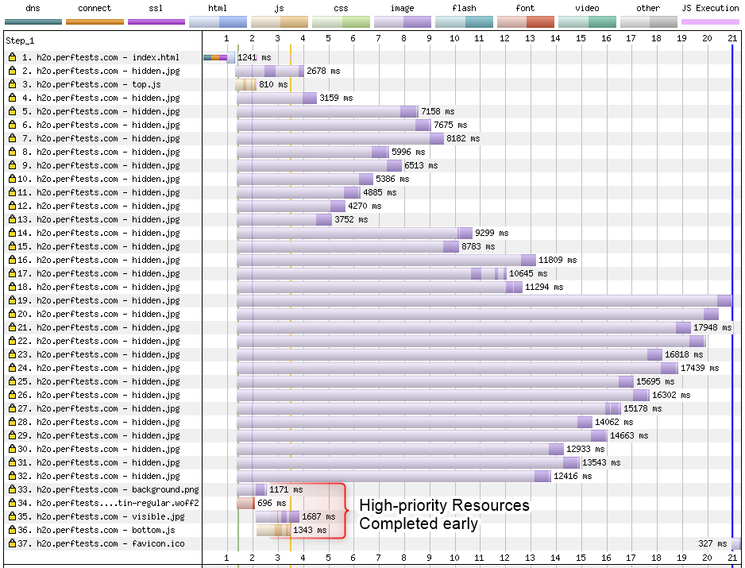
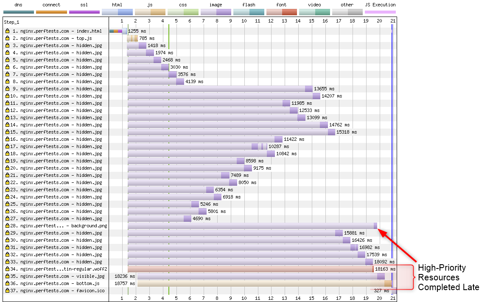
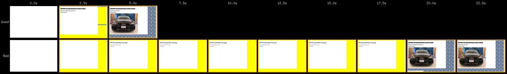

# http2priorities
Test Page for HTTP/2 prioritization (server and browser)

Server support for HTTP/2 prioritization requires getting a lot of things right (more details in the [Cloudflare blog post](https://blog.cloudflare.com/http-2-prioritization-with-nginx/)).

This is a test page for exercising HTTP/2 prioritization (particularly for Chrome). It is structured in such a way that the preload scanner will discover low-priority images that are displayed below the viewport and start loading them before 4 high-priority resources are discovered:

1. The custom font used for the page (not discovered until layout).
1. The background "pebble" image used for the page background (not discovered until layout).
1. The image of the car visible in the viewport (injected by javascript at the top of the page).
1. A blocking script at the end of the document (injected by document.write).

The text near the top of the page will also change after the last blocking script is loaded to indicate that DOMContentLoaded has fired.

The test should work well on all modern browsers but it depends on browsers doing something intelligent with priorities. It was crafted specifically to exercise Chrome's prioritization and expose server prioritization issues.

To test, I HIGHLY recommend running the testing with a slow network connection (1.6 Mbps 3G should be fine). That will make any issues glaringly obvious. In case it wasn't obvious, you will need to deploy this test page on your server to use it as a test target and make sure it is HTTPS (otherwise HTTP/2 will not be used).

When it is working well you will see the important resources at the end of the waterfall completing quickly:

When it is not working well you will see them delayed significantly:

The visual experience is also significantly faster when working correctly:

